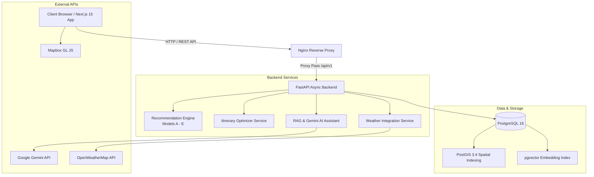

# 🌍 AI-Powered Tourism & Travel Intelligence Platform

> **Pakistan-First · Research-Grade · FYP Platform**

An intelligent, production-ready SaaS tourism platform combining **personalized multi-model recommendations**, **constraint-based itinerary optimization**, **geospatial exploration (PostGIS)**, **pgvector semantic search (RAG)**, and **tool-calling AI assistants (Gemini LLM)**.

---

## 📸 Overview & Key Features

- 🎯 **Multi-Model Recommendation Engine**: Implements 5 distinct recommendation strategies (Model A through Model E)—from baseline popularity to Collaborative Filtering (Matrix Factorization) and RAG-based LLM contextual re-ranking.
- 🗓️ **Constraint-Aware Itinerary Planner**: Dynamically generates multi-day travel itineraries optimized for budget, travel pace, geographical distances, and venue opening hours using custom greedy heuristic optimizers.
- 🤖 **Tool-Calling AI Travel Assistant**: Conversational agent powered by Google Gemini LLM with real-time tool execution (places search, itinerary generation, weather lookup, and route mapping).
- 📍 **Geospatial & Vector Search**: Powered by PostgreSQL 16, PostGIS 3.4 for spatial indexing, and `pgvector` for semantic similarity over destination descriptions and user reviews.
- 🌤️ **Real-Time Weather Integration**: Live weather data retrieval and forecast integration for tourist destinations across Pakistan.
- 🎨 **Modern Next.js 15 Frontend**: Glassmorphism UI, interactive travel maps, dark mode, responsive dashboards, atmospheric overlays, and real-time streaming notifications.

---

## 🏗️ Tech Stack & System Architecture



### Stack Breakdown

| Layer | Technology | Key Capabilities |
| :--- | :--- | :--- |
| **Frontend** | Next.js 15 (App Router), TypeScript, Tailwind CSS | Server & Client Components, Lucide Icons, Glassmorphism design |
| **Backend** | FastAPI (Python 3.11+), Async SQLAlchemy 2.0, Pydantic v2 | Async I/O, OpenAPI auto-docs, Alembic database migrations |
| **Database** | PostgreSQL 16 + PostGIS 3.4 + `pgvector` | Spatial queries, vector distance similarity (Cosine/L2), ACID compliance |
| **AI / ML** | Google Gemini LLM, `sentence-transformers`, `scikit-learn` | Tool calling, TF-IDF vectorizers, Matrix Factorization, Contextual Re-ranking |
| **DevOps** | Docker, Docker Compose, Nginx, GitHub Actions | Multi-stage Docker builds, reverse proxy routing, CI/CD pipeline |

---

## 🚀 Quickstart (Local Development with Docker)

### 1. Clone & Configure Environment

```bash
git clone <your-repository-url>
cd Tourism-Saas
cp .env.example .env
```

Edit `.env` to supply your API keys:
- `GEMINI_API_KEY`: Your Google Gemini API Key
- `MAPBOX_ACCESS_TOKEN`: Mapbox Token for map rendering
- `OPENWEATHER_API_KEY`: OpenWeather API Key (optional, defaults to fallback mock data if omitted)

### 2. Launch Full Stack

```bash
docker compose up --build -d
```

### 3. Apply Database Migrations & Seed Data

```bash
docker compose exec backend alembic upgrade head
docker compose exec backend python app/db/seed.py
```

### Service Access Links

- 🌐 **Frontend App**: `http://localhost:3000`
- ⚙️ **Backend API Documentation**: `http://localhost:8000/docs` (Swagger UI)
- 🔀 **Nginx Unified Endpoint**: `http://localhost`

---

## 🧪 Testing & Code Quality

### Running Backend Tests
```bash
cd backend
pytest tests/ -v
```

### Running Code Quality Checks
```bash
ruff check backend/
```

---

## 🔬 Recommendation Models & Evaluation Framework

The platform implements 5 recommendation algorithms for comparative empirical evaluation:

1. **Model A (Baseline)**: Popularity + Category Match heuristic.
2. **Model B (Content-Based)**: TF-IDF vector similarity over destination tags and descriptions.
3. **Model C (Collaborative Filtering)**: Implicit feedback Matrix Factorization.
4. **Model D (Hybrid)**: Weighted ensemble of Content-Based, Collaborative Filtering, and Contextual score.
5. **Model E (RAG + Contextual LLM Reranking)**: PGVector similarity search re-ranked by Gemini LLM based on user intent and budget constraints.

Evaluation scripts and metrics (Precision@K, Recall@K, MAP@K, Intra-List Diversity) are located under [`ml/experiments/`](./ml/experiments/).

---

## 📁 Repository Structure

```
Tourism-Saas/
├── .github/                 # CI/CD Workflows & GitHub templates
│   └── workflows/           # GitHub Actions (ci.yml, cd.yml)
├── backend/                 # FastAPI Application Source Code
│   ├── alembic/             # Database migration scripts
│   ├── app/                 # Core backend modules
│   │   ├── api/v1/          # REST API endpoints (Auth, Places, Trips, AI, Recs)
│   │   ├── core/            # Config, Security, DB session management
│   │   ├── models/          # SQLAlchemy ORM models
│   │   ├── schemas/         # Pydantic schemas (Validation)
│   │   └── services/        # Recommendation, RAG, Optimizer, Weather services
│   ├── scripts/             # Data ingestion & pipeline scripts
│   └── tests/               # Pytest suite
├── data/                    # Raw & processed data directories
├── docs/                    # Architectural & API documentation
│   ├── architecture/        # System diagrams & ER schemas
│   ├── api.md               # Complete REST API specification
│   ├── setup_guide.md       # Detailed local & production setup guide
│   └── ml_models.md         # Recommendation system documentation
├── frontend/                # Next.js 15 App Router Frontend
│   ├── public/              # Static assets & fonts
│   └── src/                 # Next.js pages, components, types, styles
├── infrastructure/          # Nginx & Docker deployment configs
├── ml/                      # Machine learning experiments & evaluation scripts
├── docker-compose.yml       # Production/Dev container orchestration
└── README.md                # Main documentation overview
```

---

## 📄 License & Attribution

Maintained as part of an undergraduate Final Year Research Project (FYP). Released under the MIT License.
