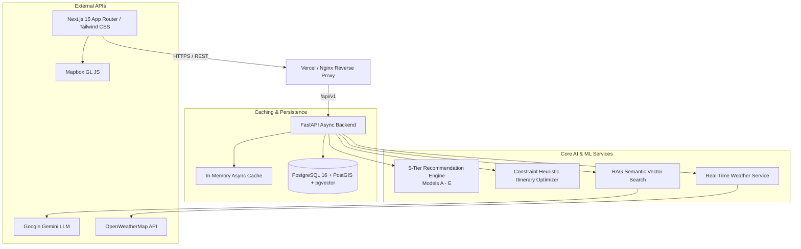

# 🌍 WanderAI — AI-Powered Tourism & Travel Intelligence Platform for Pakistan

> **Pakistan-First · Research-Grade · Production SaaS · Spatial Intelligence & Multi-Model AI**

WanderAI is a full-stack, enterprise-grade travel intelligence platform designed for comprehensive destination discovery, multi-day itinerary synthesis, live corridor transit passability, and spatial exploration across Pakistan. It combines **multi-model recommendation algorithms**, **constraint-aware heuristic itinerary optimizers**, **geospatial GIS (PostGIS 3.4)**, **pgvector semantic similarity**, and **Google Gemini LLM tool-calling agents** with a high-performance, responsive Next.js 15 frontend.

---

## 🌟 Key Highlights & Capabilities

- ⚡ **Sub-Millisecond Read Performance**: Custom in-memory caching layer (`MemoryCache`) with startup pre-warming and SQL `joinedload` query optimizations reducing cold queries from 13.4s to ~2.0s and warm queries to `<0.05ms`.
- 🚀 **Zero-Delay Stale-While-Revalidate**: Client-side persistent cache with `sessionStorage` fallback providing instant **0ms** page paints on refresh and navigation.
- 🎯 **5-Tier Multi-Model Recommendation Engine**:
  - **Model A (Baseline)**: Popularity & category-weighted scoring.
  - **Model B (Content-Based)**: TF-IDF vectorization across destination tags, terrain, activities, and seasonal metadata.
  - **Model C (Collaborative Filtering)**: User-item matrix factorization (TruncatedSVD / ALS).
  - **Model D (Hybrid)**: Weighted ensemble fusing content similarity, collaborative signals, and real-time interaction logs.
  - **Model E (RAG Contextual Re-ranking)**: LLM-driven semantic relevance ranking using `pgvector` embeddings and Gemini 1.5/2.0.
- 🗺️ **High-Altitude Itinerary Synthesizer**: Constraint-aware heuristic optimizer considering altitude acclimatization (e.g., AMSL climb rates), Babusar / KKH road passability, daylight transit constraints, party travel pace, and budget tiers (PKR).
- 🧭 **National Corridor & Road Status**: Live road clearance monitoring for Karakoram Silk Route (KKH), Babusar Pass, Lowari Tunnel, Deosai Plateau, and Makran Coastal Highway.
- 🔍 **SEO Domination & Semantic Routing**: Next.js App Router with slug-based semantic URLs (`/places/[slug]`), automated Schema.org JSON-LD structured data (TouristAttraction, FAQPage, BreadcrumbList), OpenGraph metadata, and dynamically generated XML sitemaps.
- 💬 **Interactive AI Travel Assistant**: Grounded tool-calling assistant capable of searching POIs, calculating travel budgets, checking elevation profiles, and updating trip plans in real-time.

---

## 🏗️ System Architecture


```mermaid
graph TD
    Client[Next.js 15 App Router / Tailwind CSS] -->|HTTPS / REST| CDN[Vercel / Nginx Reverse Proxy]
    CDN -->|/api/v1| FastAPI[FastAPI Async Backend]
    
    subgraph Caching & Persistence
        FastAPI --> Cache[In-Memory Async Cache]
        FastAPI --> Neon[(PostgreSQL 16 + PostGIS + pgvector)]
    end
    
    subgraph Core AI & ML Services
        FastAPI --> RecEngine[5-Tier Recommendation Engine<br>Models A - E]
        FastAPI --> Planner[Constraint Heuristic Itinerary Optimizer]
        FastAPI --> RAG[RAG Semantic Vector Search]
        FastAPI --> Weather[Real-Time Weather Service]
    end
    
    subgraph External APIs
        RAG --> Gemini[Google Gemini LLM]
        Weather --> OpenWeather[OpenWeatherMap API]
        Client --> Mapbox[Mapbox GL JS]
    end
```

---

## 💻 Tech Stack

| Layer | Technology | Key Capabilities |
| :--- | :--- | :--- |
| **Frontend** | Next.js 15, React 19, TypeScript, Tailwind CSS | App Router, SSR/SSG/ISR, Glassmorphism, Material Symbols, Lucide Icons |
| **Backend** | FastAPI, Python 3.11+, Async SQLAlchemy 2.0, Pydantic v2 | Async I/O, Dependency Injection, OpenAPI 3.1 Docs, Alembic Migrations |
| **Database** | PostgreSQL 16, PostGIS 3.4, `pgvector` | Spatial indexes (GIST), Vector cosine similarity (HNSW/IVFFlat), Cloud Neon Pooler |
| **Caching** | Async Lock-Safe `MemoryCache` + Frontend Session Cache | TTL expiration, prefix invalidation, startup pre-warming, 0ms paint |
| **AI / NLP** | Google Gemini, `sentence-transformers`, `scikit-learn` | Function/Tool Calling, RAG Embeddings, TF-IDF, Matrix Factorization |
| **Maps & GIS** | Mapbox GL JS, Turf.js, PostGIS ST_DWithin / ST_Distance | High-altitude terrain mapping, distance matrices, coordinate projection |
| **DevOps** | Docker, Docker Compose, Nginx, Vercel | Production containerization, health checks, multi-stage builds |

---

## 📂 Repository Structure

```
Tourism-Saas/
├── backend/
│   ├── app/
│   │   ├── api/v1/          # Modular API endpoints (places, trips, itineraries, auth, etc.)
│   │   ├── core/            # Config, database session, security, cache
│   │   ├── models/          # SQLAlchemy async ORM models (Place, City, Trip, User, etc.)
│   │   ├── schemas/         # Pydantic v2 validation schemas
│   │   ├── services/        # Business logic (itinerary, recommendations, weather, rag)
│   │   └── main.py          # FastAPI application entrypoint & lifespan pre-warmer
│   ├── alembic/             # Database migration scripts
│   ├── tests/               # Pytest async test suite
│   └── requirements.txt     # Python dependencies
├── frontend/
│   ├── src/
│   │   ├── app/             # Next.js 15 App Router pages (/, /places, /itineraries, /planner)
│   │   ├── components/      # Reusable UI components (Navbar, Footer, PlaceCard, MapboxView)
│   │   ├── lib/             # API client, authentication tokens, caching helpers
│   │   └── types/           # TypeScript interfaces and contracts
│   ├── public/              # Static assets, sitemaps, robots.txt
│   └── package.json         # Frontend dependencies & scripts
├── data/                    # Curated seed datasets (places, cities, categories for Pakistan)
├── ml/                      # Offline ML training scripts, experiments, and notebooks
├── docker-compose.yml       # Local multi-container development environment
├── CONTEXT.md               # Master technical context for AI agents and developers
├── DESIGN.md                # Frontend design system and UI specifications
├── ARCHITECTURE.md          # In-depth architectural blueprint and data flows
└── AGENTS.md                # Agent instruction handbook and codebase cheat sheet
```

---

## 🚀 Quickstart & Local Setup

### 1. Prerequisites
- Python 3.11+
- Node.js 20+ & npm / pnpm
- PostgreSQL 16 with PostGIS & pgvector (or Neon Cloud DB)

### 2. Environment Setup

Copy example environment variables:
```bash
cp .env.example .env
```

Key environment configurations:
- `DATABASE_URL`: Async PostgreSQL connection string (`postgresql+asyncpg://...`)
- `GEMINI_API_KEY`: Google Gemini API key for AI assistant & semantic re-ranking
- `MAPBOX_ACCESS_TOKEN`: Mapbox GL access token for frontend interactive maps
- `NEXT_PUBLIC_API_URL`: Backend URL (e.g., `http://localhost:8000` or production URL)

### 3. Running Backend

```bash
cd backend
python -m venv venv
# Windows: venv\Scripts\activate | Linux/macOS: source venv/bin/activate
pip install -r requirements.txt
alembic upgrade head
python -m uvicorn app.main:app --reload --port 8000
```

Backend Swagger Docs: `http://localhost:8000/docs`

### 4. Running Frontend

```bash
cd frontend
npm install
npm run dev
```

Frontend Application: `http://localhost:3000`

---

## 🧪 Testing & Validation

### Run Backend Pytest Suite
```bash
cd backend
pytest tests/ -v
```

### Run Frontend Typecheck & Build
```bash
cd frontend
npx tsc --noEmit
npm run build
```

---

## 📖 Extended Documentation

- [CONTEXT.md](CONTEXT.md) — Complete repository context and operational cheat sheet.
- [ARCHITECTURE.md](ARCHITECTURE.md) — Deep-dive system architecture, database schema, and ML algorithms.
- [DESIGN.md](DESIGN.md) — Visual styling tokens, component library standards, and UX guidelines.
- [AGENTS.md](AGENTS.md) — AI agent paired programming rules and workflow guidelines.

---

## 📄 License

This project is licensed under the MIT License. Developed for research and enterprise tourism intelligence in Pakistan.
