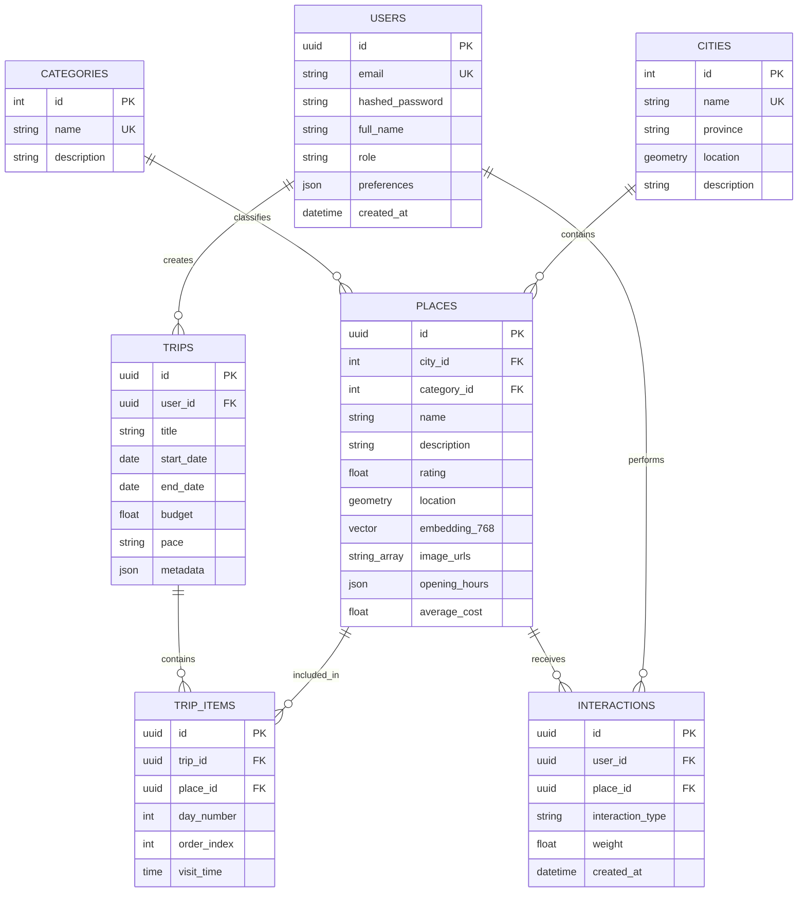
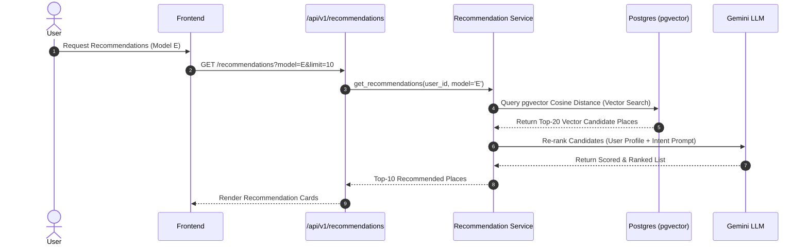
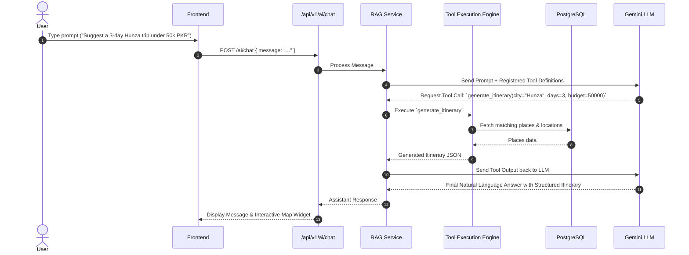

# System Architecture Documentation

This document describes the architectural layout, data models, entity relationships, and key pipeline execution flows of the AI-Powered Tourism & Travel Intelligence Platform.

---

## 🏢 System Overview

The platform uses a **Modular Monolith Architecture** designed for high modularity, easy maintenance, and research-grade scalability.

```mermaid
flowchart TB
    subgraph Client Tier
        UI[Next.js 15 App Router Frontend]
        MB[Mapbox GL JS]
    end

    subgraph Gateway Tier
        NGINX[Nginx Reverse Proxy]
    end

    subgraph Application Tier (FastAPI)
        API[API Router /api/v1]
        AUTH[Auth & User Module]
        PLACES[Places & Category Module]
        REC[Multi-Model Recommendation Engine]
        OPT[Itinerary Constraint Optimizer]
        RAG[RAG Engine & Tool Service]
        WX[Weather Service]
    end

    subgraph Data & Storage Tier
        PG[(PostgreSQL 16)]
        GIS[PostGIS Extension - Spatial Queries]
        VEC[pgvector Extension - 768d Embeddings]
    end

    subgraph External Services
        GEMINI[Google Gemini 1.5/Flash LLM]
        OWM[OpenWeatherMap API]
    end

    UI -->|REST / JSON| NGINX
    UI -->|Render Maps| MB
    NGINX -->|Pass Request| API
    API --> AUTH
    API --> PLACES
    API --> REC
    API --> OPT
    API --> RAG
    API --> WX

    AUTH & PLACES & REC & OPT & RAG --> PG
    PG --- GIS
    PG --- VEC

    RAG --> GEMINI
    WX --> OWM
```

---

## 🗄️ Database Entity-Relationship (ER) Schema

PostgreSQL 16 stores core database entity tables with spatial data handled via PostGIS geometry columns and semantic vector representations handled via `pgvector`.



---

## 🔄 Execution Pipelines & Workflows

### 1. Multi-Model Recommendation Pipeline



### 2. RAG & Tool-Calling Assistant Execution



---

## ⚡ Performance & Scalability Considerations

1. **Spatial Indexing**: PostGIS `GIST` indexes on `places.location` ensure sub-millisecond bounding box and distance query speeds.
2. **Vector Indexing**: `HNSW` (Hierarchical Navigable Small World) index on `places.embedding_768` enables fast approximate nearest neighbor (ANN) vector retrieval.
3. **Database Connection Pooling**: SQLAlchemy Async Engine with connection pooling (`pool_size=10`, `max_overflow=20`) handles high concurrent throughput.
4. **Static & Media Asset Delivery**: Image assets and fonts are served via optimized CDN or static cache headers in Nginx.
